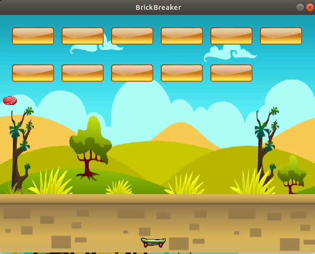
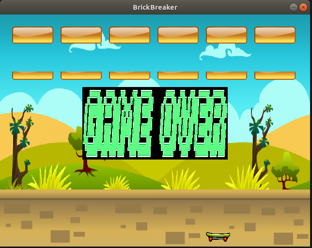

# CPPND: Capstone BrickBreaker

The game was created using a tutorial that i learnt from Udemy, it tries to simulate a classical 2D game known as brickbreaker. However, during the tutorial the code was written in a procedural manner without any OOP or using modern C++ techniques that was taught in Udacity. I really wanted to practice and push myself beyond my comfort level and practice as much as what i have learnt. My attempt was to create the game from scratch in a OOP manner. The game is not perfect and has a few bugs but i will strive to work on improving it.

## Gameplay 

The goal of the game is to break all the bricks by bouncing the ball off the bat without touching the floor of the window. If you managed to break all 12 bricks, you win the game. If the ball hits the floor of the window, the game ends.

## Game Losing Screenshot

## Dependencies for Running Locally
* cmake >= 3.7
  * All OSes: [click here for installation instructions](https://cmake.org/install/)
* make >= 4.1 (Linux, Mac), 3.81 (Windows)
  * Linux: make is installed by default on most Linux distros
* SDL2 >= 2.0
  * All installation instructions can be found [here](https://wiki.libsdl.org/Installation)
  >Note that for Linux, an `apt` or `apt-get` installation is preferred to building from source. 
* gcc/g++ >= 5.4
  * Linux: gcc / g++ is installed by default on most Linux distros

## Basic Build Instructions

1. Clone this repo.
2. Make a build directory in the top level directory: `mkdir build && cd build`
3. Compile: `cmake .. && make`
4. Run it: `./NewGame`.

* :pushpin:**Rubric Points addressed:**

> **1. Loops, Functions, I/O**
> * ✔️ The project demonstrates an understanding of C++ functions and control structures. <Throughout the code base>
> * ✔️ The project reads data from a file and process the data, or the program writes data to a file. <See void Game::InitializeDataPath() line 26 in game.cpp>
> * ✔️ The project accepts user input and processes the input. <See void Game::handlerEvents() line 179 in game.cpp>

> **2. Object Oriented Programming**
> * ✔️ The project uses Object Oriented Programming techniques. <From the directory of the folder>
> * ✔️ Classes use appropriate access specifiers for class members. <From the various class code>
> * ✔️ Classes encapsulate behavior.

> **3. Memory Management**
> * ✔️ The project uses destructors appropriately.

